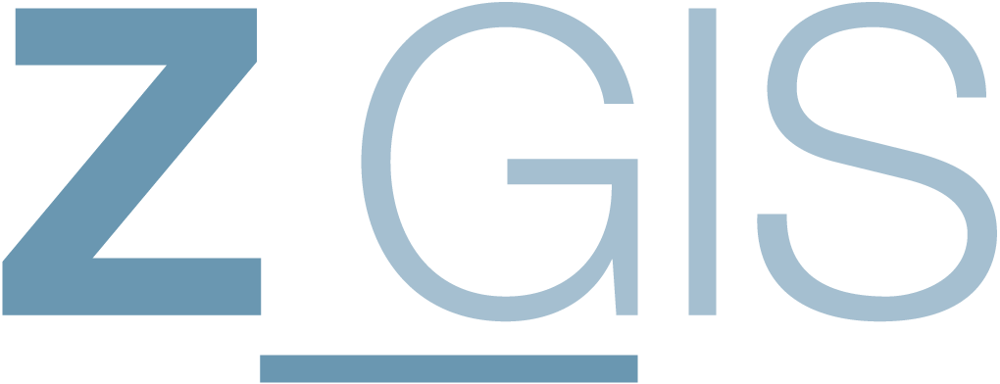
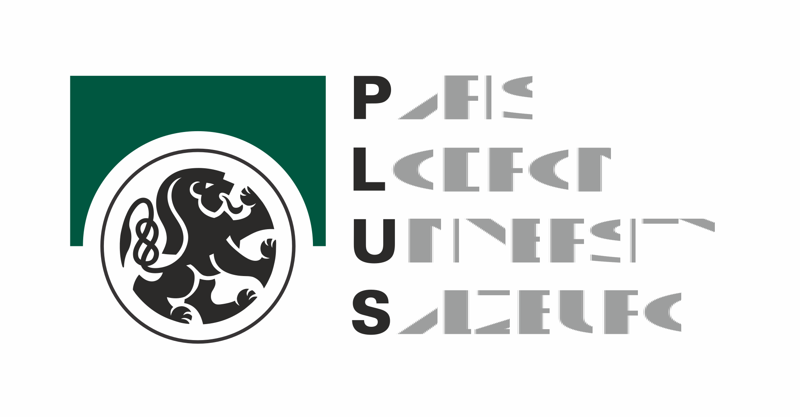

# Spatial Data Science across Languages (SDSL) 2025

__17-18 September, 2025, Salzburg, Austria__

## Goals

Spatial data science tools are not limited to a single programming language, with large communities organised around R, Python or Julia.
The SDSL workshop provides a space to bridge the communities and establish cross-language interaction between developers and users.
SDSL seeks to advance this field by bringing together the communities from the common and emerging programming languages used for data science to discuss interoperability, methodological developments, and shared challenges such as interfacing upstream libraries (including GDAL, GEOS, and PROJ), packaging and distributing software, and managing user and developer communities. 

The [first](https://r-spatial.org/sdsl/) and [second](https://spatial-data-science.github.io/2024/) installments of the workshop identified several paths for common work and the third edition plans to follow-up on these efforts as well as open the discussion on topics that have not been addressed so far. 
Topics and issues raised in previous editions will be pushed further through dedicated hackathons.

The topics you may expect to be part of the discussion include:

- File formats and data connectivity
- Conventions and open standards
- Spherical geometries and mapping defaults
- Web mapping and visualisation
- Big data handling and analysis (movement, EO, etc.)
- Spatial network analysis
- Spatial statistics and ML
- Interoperability between packages and languages
- Learning resources and teaching methods
- Communities and governance models

However, the list is not exhaustive or fixed.

The goal of the workshop is to attract a maximum of 30 on-site attendees.

## Venue

The workshop will be held Sept 17 & 18, 2025, at the [Unipark Campus of the Paris Lodron University Salzburg](https://www.plus.ac.at/?lang=en).

The address is:

> Erzabt-Klotz-Straße 1 
> 5020 Salzburg 
> Austria 

([OpenStreetMap](https://www.openstreetmap.org/way/127807575) | [Google Maps](https://maps.app.goo.gl/g6yCwPMGSqyynjka8))

## Program Committee

- [Martin Fleischmann](https://martinfleischmann.net/)
- [Edzer Pebesma](https://www.uni-muenster.de/Geoinformatics/institute/staff/index.php/119/Edzer_Pebesma)
- [Anita Graser](https://anitagraser.com/)
- [Jakub Nowosad](https://jakubnowosad.com)
- [Maarten Pronk](https://www.deltares.nl/en/expertise/our-people/maarten-pronk)
- [Geoff Boeing](https://geoffboeing.com/)
- [Lorena Abad](https://loreabad6.github.io/)

## Local committee

- Martin Sudmanns
- Christian Neuwirth
- [Lorena Abad](https://loreabad6.github.io/)

In case of any queries, please contact Lorena ([lorena.abad@plus.ac.at](mailto:lorena.abad@plus.ac.at)).

## Registration

Registrations will be opened around May. 
Note that the number of participants is limited.

### Online Attendance

Online attendance will be possible. 
<!-- Online participation is free of charge. If you plan to join the symposium online, please indicate that in the registration form. -->

## Discord

SDSL has a Discord server that will be used for communication during the workshop. Please join via [https://discord.gg/HJRKEJsmrr](https://discord.gg/HJRKEJsmrr).

## Program

_To be announced_

## Supported by

  

 